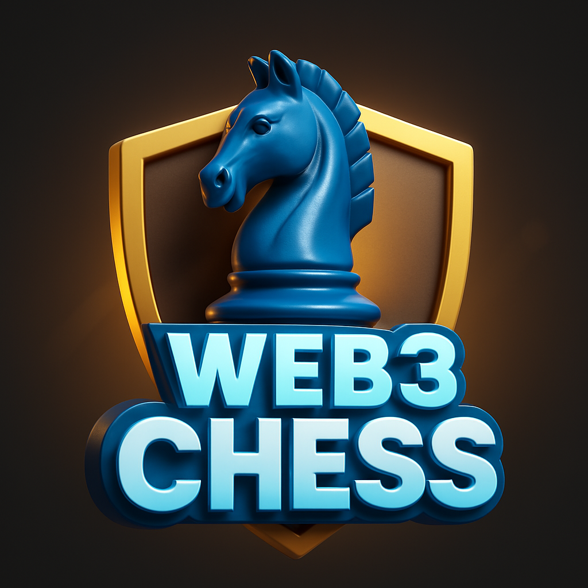

# ChessFi



## Play Chess. Bet Crypto. Win Big.

ChessFi is a revolutionary web3-based multiplayer chess platform where players can challenge each other and bet cryptocurrency on the outcome of their matches.

## ♟️ How It Works

1. **Challenge a Player**: Send a game request with your chosen crypto betting amount
2. **Accept the Challenge**: Opponents can accept if they agree with the betting terms
3. **Verify Funds**: Smart contracts verify both players have sufficient funds
4. **Lock the Stakes**: Betting amounts are automatically locked in a secure blockchain contract
5. **Play & Win**: The winner receives the entire pot after the game concludes

## 💰 Betting System

- **Secure Escrow**: All bets are held in a tamper-proof smart contract
- **Transparent Odds**: Know exactly what you stand to win before playing
- **Instant Payouts**: Winnings are automatically transferred to the victor's wallet
- **Multiple Tokens**: Support for various cryptocurrencies

## 🚀 Features

- **Beautiful Chess Interface**: Smooth, intuitive gameplay experience
- **Blockchain Security**: All games and bets verified on-chain
- **Match History**: Review past games and betting performance
- **Tournament Support**: Join competitive events with prize pools

## 🔧 Technical Stack

- **Frontend**: React.js with Web3 integration
- **Smart Contracts**: Solidity on Ethereum/compatible networks
- **Chess Engine**: Custom implementation with blockchain validation


## ⚙️ Development

```bash
# Clone the repository
git clone https://github.com/yourusername/chessfi.git

# Install dependencies
cd chessfi
npm install

# Run development server
npm run dev
```

## 🤝 Contributing

We welcome contributions! Please see [CONTRIBUTING.md](CONTRIBUTING.md) for details.

## 📄 License

ChessFi is licensed under the MIT License - see the [LICENSE](LICENSE) file for details.
